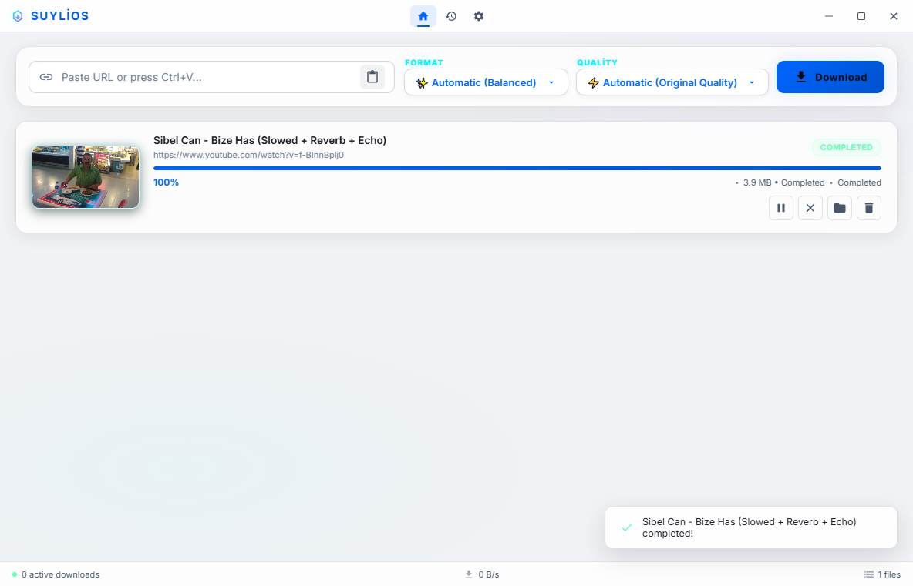
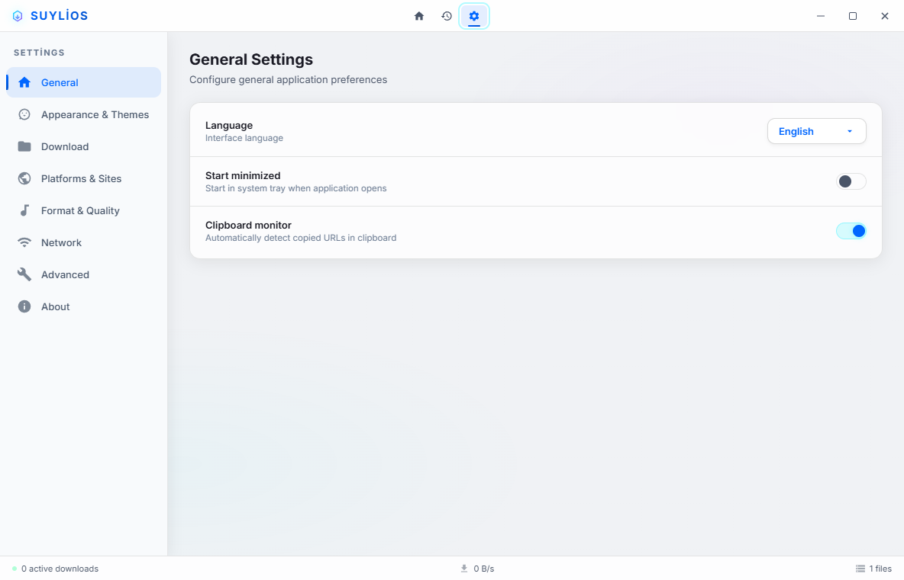
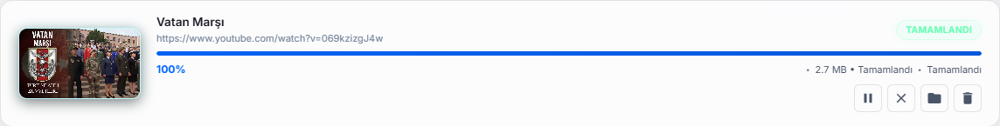

# Suylios Downloader

**Next-Generation Cyber-Aesthetic Hybrid Media & Archive Downloader.**

---

## 🌌 Overview

**Suylios Downloader** is a futuristic desktop media command center built with a high-performance **Python/PyWebView** engine and an ultra-responsive **Glassmorphism UI**. Designed for speed, privacy, and seamless user experience, it bridges the gap between complex command-line extractors (`yt-dlp`, embedded `FFmpeg`) and sleek modern software design.

Whether you are downloading 4K/8K 60fps YouTube playlists, capturing social media reels, archiving entire albums from cloud storage hosts, or extracting lossless studio-grade audio, Suylios handles it effortlessly with single-click automation.

---

## ✨ Key Features & Highlights

### 🎨 Cyber-Aesthetic Design & Visual Themes
Experience a breathtaking interface crafted with glassmorphism panels, neon glow indicators, and smooth micro-animations. Suylios adapts to your mood and workspace with **6 Curated Aesthetic Themes**:
- 🌐 **Suylios Cyber (Default):** Deep space obsidian background paired with vibrant electric cyan and neon purple accents.
- ☀️ **Light Theme (Day):** A crisp, ultra-clean white and silver aesthetic designed for bright room lighting and maximum readability.
- 🌑 **Dark Theme (Slate):** A sophisticated charcoal metallic slate finish for minimalist setups.
- 💻 **Emerald Hacker (Green):** Matrix-inspired deep black canvas with glowing terminal green highlights.
- 🔴 **Crimson Night (Red):** Bold dark ruby styling with aggressive crimson indicators.
- 🌅 **Sunset Gold (Yellow):** Warm, luxurious golden amber accents over dark velvet backgrounds.

### ⚡ Smart Link Capture (Ctrl+V Automation)
No need to manually click input boxes. When the application window is active, simply press **`Ctrl+V`** to paste any copied URL from your clipboard. Suylios instantly parses the link, detects the platform, applies your preferred quality preferences, and launches the download queue automatically.

### 🌐 Universal Platform & Host Support
- **Mainstream Media:** YouTube (up to 8K HDR + Lossless Audio merging), Instagram Reels & Stories, TikTok (Watermark-free), Twitter / X, Twitch, Reddit, Vimeo, Dailymotion, Pinterest, Facebook, and Bilibili.
- **Cloud & File Hosts:** Direct session integration and fast multi-threaded downloading for **Gofile**, **Pixeldrain**, and **Bunkr / balbums.st**.
- **+18 & VIP Archives:** Dedicated extraction engines for adult media and galleries, featuring built-in **VIP Cookie Authentication** (e.g., ExHentai / E-Hentai passhash cookies) to bypass login barriers securely.

### 🎵 Dynamic Format & Studio Audio Conversion
Easily switch between Video and Audio modes. Suylios utilizes its isolated, embedded `FFmpeg` engine to convert playlists into pristine **320 kbps HQ MP3**, **24-bit Lossless FLAC**, **256 kbps AAC**, or lightweight audio formats on the fly—without requiring external system installations.

### 📜 Rich Media Download History
Keep track of your digital library with an redesigned, visually stunning **History Page**. Completed downloads are saved as persistent cards displaying preview thumbnails, format tags (`MP3`, `MP4`, `FLAC`), quality badges (`1080p`, `4K`), exact file sizes, and timestamps. Open downloaded files directly in your Windows Explorer with a single click.

### 🧳 100% Portable & Dynamic Path Tracking
Take your downloads anywhere. When deployed in portable mode or copied to a USB drive, Suylios stores all configuration files (`config.json`), history logs (`history.json`), and downloaded files (`/Downloads`) directly inside the application folder. If you move or rename the project folder, the smart path engine dynamically resolves the new location automatically.

### 🌍 Zero-FOUC Community Localization
Enjoy instantaneous language switching between **English** and **Turkish** with zero screen flickering or unstyled text loading (Zero-FOUC). The localization architecture is powered by external JSON dictionaries (`locales/en/en.json`, `locales/tr/tr.json`), allowing the open-source community to effortlessly contribute new languages by simply dropping a new JSON file into the folder.

---

## 📸 Interface Preview

### 1. Main Command Center

> Real-time progress bars, download speed metrics, ETA calculations, and active queue monitoring.

### 2. Advanced Settings & VIP Cookies

> Customize subfolder organization, speed limits, concurrent thread pools, theme palettes, and VIP authentication credentials.

### 3. Detailed Media Cards

> Rich thumbnail previews, dynamic status badges, and instant folder navigation buttons.

---

## 🚀 Quick Start Guide

### Option 1: Instant Clipboard Download
1. Copy any supported media or file URL in your web browser (`Ctrl+C`).
2. Bring **Suylios Downloader** to the focus and press **`Ctrl+V`**.
3. Sit back as your file is analyzed and downloaded at maximum speed!

### Option 2: Custom Resolution & Quality Selection
1. Paste your target URL into the top search bar.
2. Select your desired media category from the **Format** dropdown (`MP4 Video` or `MP3 Audio`).
3. Choose your preferred quality tier from the **Quality** dropdown (e.g., `🌟 4K Ultra HD (60fps)` or `🔥 320 kbps HQ MP3`).
4. Click the glowing **Download** button.

---

## 🔒 Security & Privacy Guarantee

Suylios Downloader operates with complete local isolation. All network requests are negotiated directly between your computer and the target media servers. 
- **No Telemetry:** No user analytics, IP addresses, or download logs are ever transmitted to third-party or developer cloud servers.
- **Self-Contained Engine:** Embedded binaries (`bin/ffmpeg.exe`) are executed within a restricted local sandbox to ensure optimal OS integrity and stability.

---

## 👨‍💻 Author & License

Developed with ❤️ by **Sayrias** & **Antigravity**.  
Licensed under the [MIT License](LICENSE). Feel free to fork, customize, and contribute!
